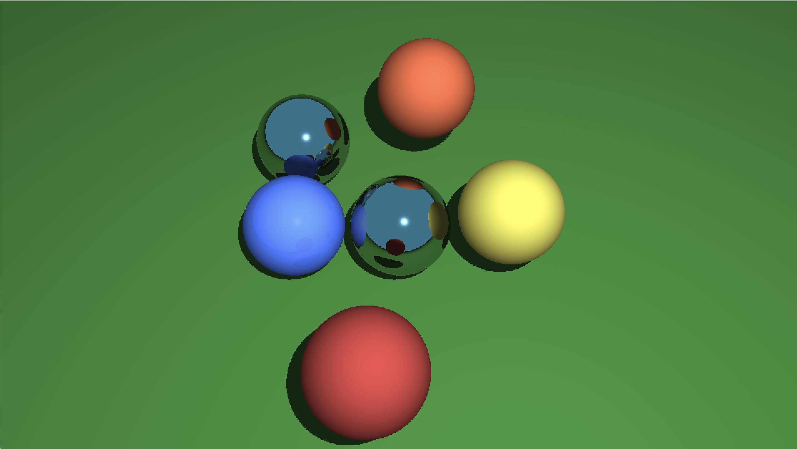

# Raytracing in C++

This is a personal project in which I build a raytracer with incremental features, that I started to learn modern C++ and computer graphics !



## Running the project

-   You need to have CMake and Make installed, as well as a C++ compiler (I mainly use Clang to develop this project, I cannot assert that it works flawlessly with GCC/MSVC).

-   To run the tests, you need to have the [Catch2](https://github.com/catchorg/Catch2) header-only library in your compiler's include path.

-   Generate the Makefile by doing :
    ```bash
    $ mkdir build
    $ cd build
    $ cmake ..
    ```
-   You can then compile and run the project with :
    ```bash
    $ make raytracer
    $ ./raytracer
    ```
    or run the tests with :
    ```bash
    $ make runtests
    $ ./runtests
    ```

If you want to change the rendered scene, you can do so in `src/main.cpp`.

## Features developed

-   [x] Ambient lighting
-   [x] Point Lights
-   [x] Basic diffuse shading
-   [x] Cast shadows
-   [x] Specular highlights (Phong illumination model)
-   [x] Perfect reflections
-   [ ] Glossy reflections
-   [ ] Texture mapping
-   [ ] Area lights
-   [ ] Anti-aliasing
-   [ ] Ambient occlusion
-   [ ] Glass material
-   [ ] Multi-threaded implementation
-   [ ] Environment mapping
