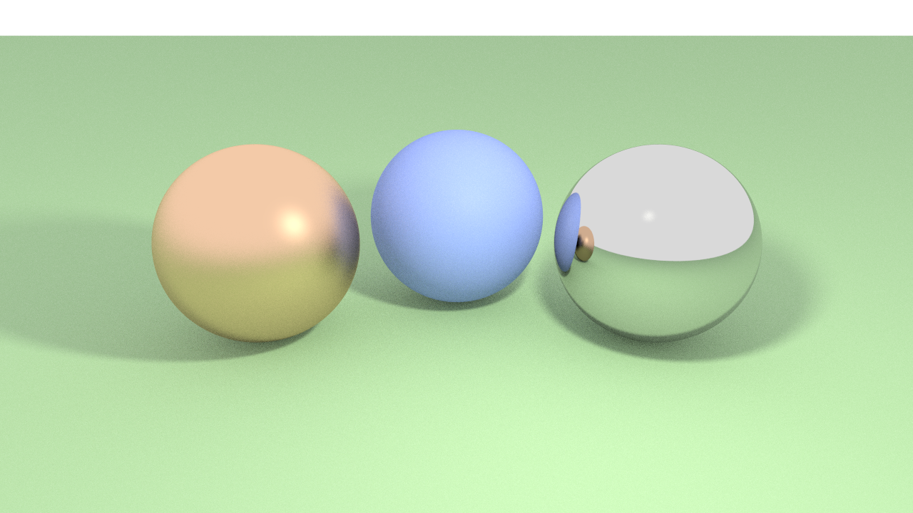

# Raytracing in C++

This is a personal project in which I incrementally build a raytracer, that I started to learn modern C++ and computer graphics. Going back at it from time to time !



## Running the project

-   Requirements : CMake, Make, a modern C++ compiler (tested with G++ >= 9), OpenMP library (for multithreading).
-   Generate the Makefile by doing :
    ```bash
    $ mkdir build
    $ cd build
    $ cmake ..
    ```
-   You can then compile and run the project with :
    ```bash
    $ make raytracer
    $ ./raytracer
    ```

If you want to change the rendered scene, you can do so in `src/main.cpp`.

## Features supported

-   [x] Global illumination via path tracing
-   [x] Area lights
-   [x] PBR material (inspired by Disney's & Blender's Principled Material although much less complete) supporting diffuse, metal, refractive and emissive
-   [x] Multithreading (using OpenMP)
-   [x] Importance sampling (for diffuse BRDF and area light sampling)
-   [x] Firefly removal
